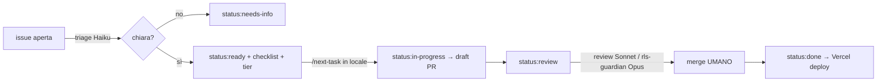

# girasole — Board + Agenti (setup ibrido)

Board su **GitHub Issues + Projects**. Cloud economico che fa solo triage e
review; il lavoro pesante lo lanci tu in locale da Claude Code Desktop.
Gli agenti **non si parlano**: coordinano leggendo/scrivendo lo stato sulla
board (le label). La board è il contratto.

## Cosa c'è in questo pacchetto

```
scripts/setup-board-labels.sh        # crea le label (la macchina a stati)
.github/workflows/claude-board.yml   # UNICA action: triage (Haiku) + review (Sonnet)
.claude/agents/triage.md             # classifica le issue        (Haiku)
.claude/agents/implementer.md        # implementa, apre draft PR   (Sonnet)
.claude/agents/reviewer.md           # review standard             (Sonnet)
.claude/agents/rls-guardian.md       # review sicurezza RLS/auth   (Opus)
.claude/commands/next-task.md        # /next-task: orchestratore locale
```

Copia queste cartelle nella radice del repo girasole (si fondono con i tuoi
`CLAUDE.md` / `SPEC.md` / `TASKS.md` esistenti, che gli agenti leggono).

## La macchina a stati



Il **merge lo fai sempre tu**. È il gate che rende sicuro tutto il resto.

## Setup (una volta sola)

1. **Secret API** — modo rapido: in Claude Code lancia `/install-github-app`,
   che installa la GitHub App e crea il secret `ANTHROPIC_API_KEY`. (Serve
   essere admin del repo.) In alternativa: Settings → Secrets and variables →
   Actions → `ANTHROPIC_API_KEY`.
2. **Label** — dal repo:
   ```bash
   gh auth login
   bash scripts/setup-board-labels.sh
   ```
3. **Projects** — crea un Project (New project → Board). Aggiungi il repo e
   crea una colonna per ogni stato: *Triage, Needs info, Ready, In progress,
   Review, Done*. Consiglio: nelle impostazioni del Project attiva le
   automazioni native "Item added → Triage" e "PR merged → Done", così le
   card si muovono da sole tra le colonne seguendo le label.
4. **Commit** dei file e push su trunk.

## Uso quotidiano

- **Apri una issue** descrivendo bug/feature (anche in due righe). L'action di
  triage risponde da sola: la etichetta, le dà un `tier:` e o la marca
  `status:ready` con una checklist, o chiede chiarimenti.
- **Quando vuoi far lavorare un agente**, apri Claude Code Desktop nel repo e
  scrivi `/next-task` (o `/next-task 42` per una issue specifica). L'agente
  implementa su un branch e apre una **draft PR**.
- **La PR aperta** riceve una review automatica (Sonnet). Se tocca RLS/auth,
  la review si ferma e chiede l'ok di `rls-guardian` (Opus): lo lanci tu in
  locale sulla PR.
- **Tu revisioni e mergi.** Vercel deploya. La issue si chiude da sé
  (`Closes #n`).

## Le leve di costo (già cablate qui)

- **Routing per label**: Haiku sul triage (gira tanto), Sonnet sul grosso,
  Opus solo su RLS/auth. Prezzi per milione di token (input/output, set 2026):
  Haiku 4.5 `$1/$5`, Sonnet 5 `$2/$10`, Opus 5 `$5/$25`.
- **Guardrail per run**: `--max-turns` e `timeout-minutes` nel workflow;
  `concurrency` annulla i run duplicati.
- **Fork-safety**: il job di review non parte sulle PR da fork (niente secret,
  zero crediti spesi) — giusto per un repo pubblico.
- **Prompt caching**: tieni `CLAUDE.md`/`SPEC.md` stabili; i cache hit costano
  il 10% dell'input. Contesto condiviso grande e stabile = grosso risparmio.
- **Alert di spesa**: imposta un budget/alert nella Console Anthropic.

## Note

- I nomi modello (`claude-haiku-4-5`, `claude-sonnet-5`, `claude-opus-5`)
  possono richiedere lo snapshot pinnato: verifica sui docs se un run fallisce
  sul model id.
- Quando ti fidi del flusso, puoi promuovere un secondo step in cloud (es. far
  partire l'implementer su `status:ready` con assegnazione a `@claude`). Ma
  parti così: un solo passo automatico economico, il resto in mano tua.
